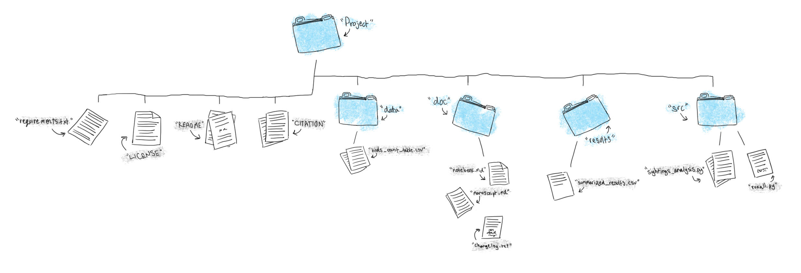

# Lesson1


## Part 1--Setting up a Reproducible Structure
Start by navigating to a folder that will serve as the host of the main repository, e.g. ```/rob/research/projects```

Once there, replicate this folder structure. 



I recommend doing this on the command line first, just to get some familiarity, but if you want to do it with Windows Explorer or Finder, that's fine too. Here are the commnads to generate the folders. This are issued at the command line (mac - terminal, windows - gitbash):


```bash
mkdir myrepo
cd myrepo
mkdir doc
mkdir src
mkdir results
mkdir data
```

Now make some files at the root level of the directory:

```bash
touch LICENSE
touch README
touch CITATION
```

Ok - all done - for now. Let's talk about what goes into each, and then we'll start to populate the folders a bit.

## Part 2--Populate The Folders
### Start With Raw Data
I've given you a raw dataset from the Bahamas Marine Mammal Research Organization. They are in csv format. 

1. Download them from box
2. Put the file into your ```data``` folder. 

If you want, you can look at them with the ```head``` command - like above this is a unix command that you issue on the command line. Note where you are on the command line first, otherwise you may be looking for data in all the wrong places.


```bash
head bbmroData.csv --lines=2
```

### Generate A Few Scripts
Ok, at this point we have a file structure, and raw data - nothing else. But let's keep going with a simple R script to read in the data. Make a script in the ```src``` folder and call it something clever like ```readData.R``` Try this first on the command line.


```bash
touch readData.R
```

While we're at it, let's make three more empty files:


```bash
touch summarizeData.R
touch plotData.R
touch runRegression.R
```

And then we'll make a controller script, since that will be useful.


```bash
touch runAll.R
```


That will make the files, but they're going to be empty just now.

Ok, that's it for this lesson.
