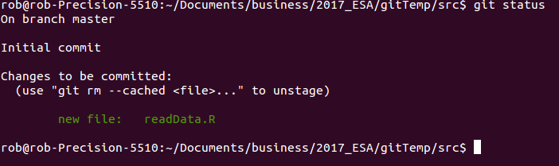
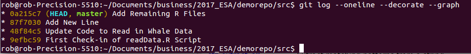
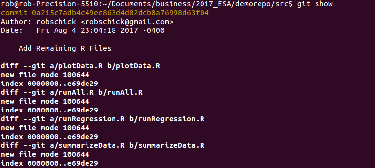
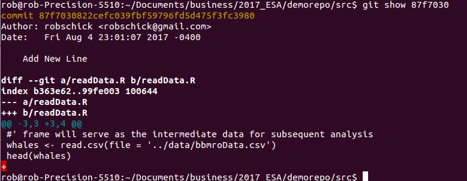
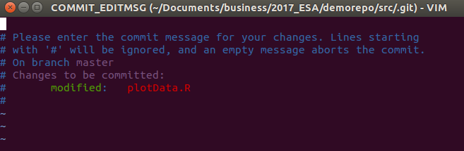
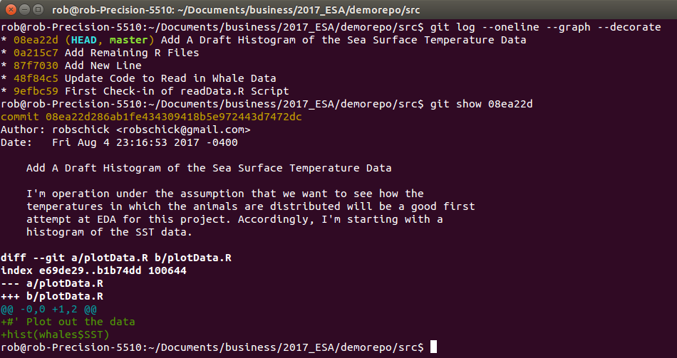
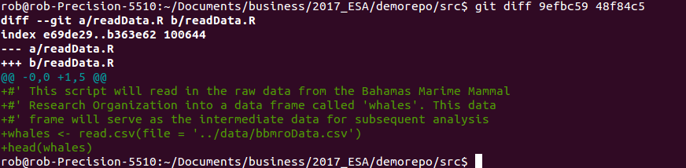
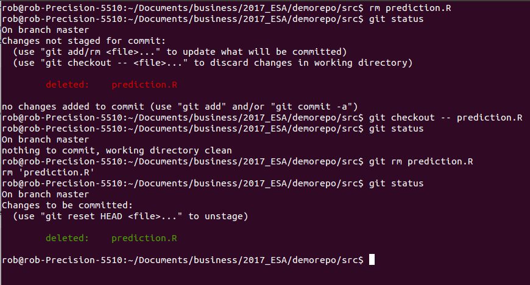
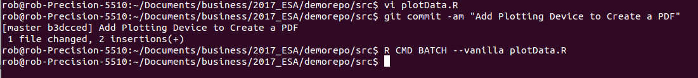

```{r setup, include=FALSE}
knitr::opts_chunk$set(echo = TRUE)
```

Awesome. Now we're ready to move things along with git somewhat. At this point, we've made a structure that's consistent, and can form the basics of a reproducible workflow. We've talked about one way to manually track the changes of the whole project - namely taking the whole structure, and putting it into a folder with a date-specific name, e.g. ```20170-08-06-contents-of-myRepo```

This can work, and is not a bad setup, but it requires a lot of intervention and consistency on the part of you the project organizer. One other drawback - in my mind - is that with more than one user and/or more than one computer, it's very hard to scale. Things can get complicated and out of phase/sync quickly. The solution? A modern version control system; here we'll explore ```git```


```git``` was written by Linus Torvalds - the creator of Linux. It was an outflow of bitkeeper, and was built to manage the linux kernel. Undoubtedly this is a bigger project than you or I will ever work on. At present the kernel is approximately 17 million lines of code, with 2-3 thousand contributing developers. No wonder they need a robust system. We've talked about what ```git``` is in the lecture, and now we'll start to put it into practice. 

Let's ```cd``` into the ```src``` directory. Type ```pwd``` just to make sure you are where you think you are. Then let's initialize the repository:

```{r gitInit, engine = 'bash', eval = FALSE}
git init
```

If successful, all you'll get a message indicating that you have initalized am empty repository. Success!

Next let's look at the status:

```{r gitstatus, engine = 'bash', eval = FALSE}
git status
```

You will see a message about being on branch master, that you are on the initial commit, and that there is nothing to commit. Ok, so what now? Let's add a file to the staging area. Recall that there are three states of git:

1. the working directory
2. the staging area
3. and the git repo itself - i.e. where things end up when you commit

Right now we are in the staging area, and we should have 5 ```*.R``` files - 4 that will do something eventually, and one that will run all the others. Let's add the first one ```readData.R``` (or whatever you named the file to read in the data).


```{r add1stFile, engine = 'bash', eval = FALSE}
git add readData.R
```

You should get nothing back - just the command prompt again. But if you ask for the status again, you'll see something different:

```{r statusII, engine = 'bash', eval = FALSE}
git status
```

Now that we've added a file to the staging area, we should see a message indicating there are changes to be committed, and it should label what the new file is. On my computer it looks like this:



Now that we've added it, let's run our first commit:

```{r firstCommit, engine = 'bash', eval = FALSE}
git commit -m "First Check-in of readData.R script"
```

Now we get some more information back from git about this commit, including the all-important sha-1 identifier. Here you only see the abbreviated sha-1, but if you type ```git log``` you'll see the full sha-1:

```{r firstLog, engine = 'bash', eval = FALSE}
git log
```

Along with who made the commit (hopefully you), the date, and the commit message. Now let's do some comparison between git and the file system. Right now we have several R scripts in the directory. What do you think you'll get when you type these commands? 

Think what the answer will be before you issue the command.

```{r firstls-files, engine = 'bash', eval = FALSE}
ls
git ls-files
```

Why the difference? What do you think you'll see if you ask for the status? Think before you issue the command:

```{r engine = 'bash', eval = FALSE}
git status
```

If you have untracked files, why is it that git knows about them?

## Going through the Cycle Again
Let's edit the file now to actually read in the data. You can do this in vi, or in the text editor of your choice. 

Here's what I added to mine (recall the tip to put at least a barebones comment at the start of the script):

```{r, eval=FALSE}
#' This script will read in raw data from the Bahamas Marine Mammal Research Organization
#' into a data frame called whales. whales will serve as the intermediate data for
#' subsequent analysis
whales <- read.csv(file = '../data/bbmroData.csv')
head(whales)
```

Now we have some new code, i.e. the file has been modified. So go back to the command prompt, and type:

```{r status, engine='bash', eval=FALSE}
git status
```

What do you see, and why is it different from whatn you issued git status a few lines back? What do you do next if you want to make a snapshot (commit) of the updated file? Add it and commit it, but this time we can do what is called an express commit. Because git already knows about ```readData.R``` we can combine the add and the commit steps:

```{r engine='bash', eval = FALSE}
git commit -am "Add Code to Ingest the Raw Data"
```

But, this can only be done for files that have already been added.

Let's go ahead and add all of the remaining untracked files and commit them:

```{r, commitAll, engine='bash', eval = FALSE}
git add .
git commit -m "Add Remaining Blank R Files"
git status
```

Your last command should indicate that you have a clean repo. Cool!

## Git Log
Now that we've made a few commits, we can start to look at how our project is evolving. Git log is a good way to do this; we've seen this before, but now we'll see a bit more

```{r, log, engine='bash', eval = FALSE}
git log
```

This is a very flexible command, however, and there are a few ways we can clean it up to make the output a bit tidier:

```{r prettylog, engine='bash', eval = FALSE}
git log --oneline --decorate --graph
```


So what all have we asked for? We've said, show us the log, but in a compact form, decorate it to have it show where the current branch (master) is pointing (HEAD), and show us the graph. Recall that git is a directed graph, where snapshots (commits) are the nodes. On the graph above we have 4 nodes, with the master branch pointing to the latest commit. We can move this pointer, but that's a topic we'll take up later.

If we want to really get a good sense of what things look like at the different nodes, use the ```git show``` command.

```{r show, engine='bash', eval = FALSE}
git show
```


And then one specific node:

```{r show2, engine='bash', eval = FALSE}
git show 87f7030
```




Once we've asked for a specific node, we get a lot of useful information about the commit, including who did it, when they did it, what the message was, and what the commit contained.

## Commit Messages
Recall what we talked about in Lecture - good commit messages are worth the effort, and will help you come back to the repo/project and understand not only what you did (use the ```diffs``` for that), but also why. If you are writing command line commit messages, it's hard to really write a thoughtful one. However, if you have an editor configured (my default is vi) then you can easily write a good one. Try it (with the knowledge that this commit is really a toy commit).You can invoke the editor by just typing ```git commit``` without any flag. Here's what I get when I type that:



Now you can type a good message with a less than 50 character Capitalized First Line, followed by detailed text that describes the why of the commit. With a declarative succinct first line, you can see at a glance what each commit is about, and then with ```git show``` you can dig in and read more.  

On the subject of declarative, here's a useful tip. You want the first line to complete this sentence = 'If added, this commit will ....'

Here's what I get - note the top part of the figure that shows the oneline with the declarative statement..."If added, this commit will Add a Draft Histogram of the Sea Surface Temperature Data."




## Git Diff
How can we easily see what changed between two commits? We may see that one line indicated a big change that we want to inspect. Use the diff command on any two nodes in the graph:

```{r diff, engine='bash', eval = FALSE}
git diff 9efbc59 48f84c5
```

Note that the order matters. The code above says show me what changed as the repo moved from ```9efbc59``` to ```48f84c5``` Here's what mine looked like:




## File Management with Git - rm and mv
One thing that is good to remember is that you've added a file to git, then it's being tracked until you delete it. And actually even if you delete it, it gets stored in previous commits - because it _was_ in that repo at one point in time. Though the file is just a file, once it's tracked, don't be tempted to remove it via the operating system. 

If you want to delete a file, or if you want to change it's name, git offers utlities to do this. Not surprisingly, they are ```git rm``` and ```git mv```. Let's see them in operation. First we'll add two files - one to move/rename and one to delete. We'll do this in the ```src``` directory again.

```{r gitAddII, engine='bash', eval = FALSE}
touch prediction.R
touch simData.R
git add .
git commit -m "Add Two Files for Experimenting with Moving and Deleting"
```

With these setup and added, let's delete it at the command line just to see what happens:

```{r removeOS, engine='bash', eval = FALSE}
rm prediction.R
```

All looks good right from the OS point of view - right? What happens when you ask ```git``` what the status is?

```{r removeStatus, engine='bash', eval = FALSE}
git status
```

What to do now? We back out the change

```{r git checkout, engine='bash', eval = FALSE}
git checkout -- prediction.R
git status

```

Now we're back to a clean working directory. So we can delete with ```git```. Not that when you do this, and look at the status, it looks very different - the first one makes a change (the deletion) that hasn't been staged, where as the second (```git rm```) makes a change that has been committed and is ready to stage:


Basically to get a clean working directory if you go the ```rm``` route, you have to add the file to the staging area, only to then commit it. ```git rm``` just does that for you in one step. 

Now is a good time to commit the deletion.

```{r engine='bash', eval=FALSE}
git commit -m "Delete prediction.R File"
```


Now that file is gone and the repo is clean, let's rename the other file - this time using git. As above, if you use git's utilities for this, you don't have to add the changes

```{r engine='bash', eval=FALSE}
git mv simData.R simXYData.R
git commit -m "Rename Simulation Script for Clarity"
```


## The .gitignore File
One person in the responses to the survey asked about what to version control and what not to. I tend to keep just the code versioned, and things that can be easily created on the fly, I ignore. If you create a lot of these files, e.g. intermediate ```*.Rdata``` files, or ```*.png``` files, etc., your repo can get pretty messy as you create them. Even if you aren't tracking them, git is aware of them, so typing git status can yield a lot of information. 

Thankfully, there's mechanism, and it's called the ```.gitignore``` file. All you have to do is create it, put in a few patterns to match (and thus have git ignore), and then place it into version control. Let's try it with a pdf file. First add the plotting device code to your ```plotData.R``` script.

```{r gitignore, eval = FALSE}
pdf(file = '../results/firstHistogram.pdf')
hist(whales$SST)
dev.off()
```

Add and commit these changes, and then let's run the code from the command line.


What do you think we'll have now? How many new files? Where and what will they be?

If you answered 2 files - gold star for you. There's the .pdf file in the ```results``` directory, but there's also the .Rout file in the ```src``` directory. But if you type ```git status``` what do you think you'll see? 

Probably not what you expected to see, at least it wasn't what I thought we'd see. 


But here's a good thing to be aware of. We only have the repo initialized in ```src```, and not in results. At any rate, there's a chance we might create the odd pdf file here in addition to the .Rout files, so let's exclude them both. We do this with the   ```.gitignore``` file, which we have to make, and which, we have to place under version control.

To do this, make a new text file, and add these two lines:

```{r engine='bash', eval=FALSE}
*.Rout
*.pdf
```

Save it as .gitignore, then add it, and then commit it.

Now let's rerun the ```R``` script that will make the ```.Rout``` file and we'll see what happens. Before you type ```git status``` what do you think you'll see?

If all goes well you'll not see anything - git will indicate that you have a clean working directory.


## Time for a Break
Before we move on to replicating this in RStudio, it's probably time for a break.

