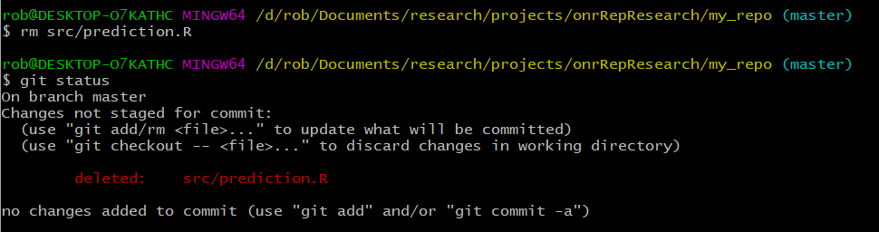

```{r setup, include=FALSE}
knitr::opts_chunk$set(echo = TRUE)
```


## Git Log
Now that we've made a few commits, we can start to look at how our project is evolving. Git log is a good way to do this; we've seen this before, but now we'll see a bit more

```{r, log, engine='bash', eval = FALSE}
git log
```

This is a very flexible command, however, and there are a few ways we can clean it up to make the output a bit tidier:

```{r prettylog, engine='bash', eval = FALSE}
git log --oneline --decorate --graph
```


So what all have we asked for? We've said, show us the log, but in a compact form, decorate it to have it show where the current branch (master) is pointing (HEAD), and show us the graph. Recall that git is a directed graph, where snapshots (commits) are the nodes. On the graph above we have 4 nodes, with the master branch pointing to the latest commit. We can move this pointer, but that's a topic we'll take up later.


## File Management with Git - rm and mv
One thing that is good to remember is that you've added a file to git, then it's being tracked until you delete it. And actually even if you delete it, it gets stored in previous commits - because it _was_ in that repo at one point in time. Though the file is just a file, once it's tracked, don't be tempted to remove it via the operating system. 

If you want to delete a file, or if you want to change it's name, git offers utlities to do this. Not surprisingly, they are ```git rm``` and ```git mv```. Let's see them in operation. First we'll add two files - one to move/rename and one to delete. We'll add these files tothe ```src``` directory.

```{r gitAddII, engine='bash', eval = FALSE}
touch src/prediction.R
touch src/simData.R
git add .
git commit -m "Add Two Files for Experimenting with Moving and Deleting"
```

With these setup and added, let's delete it at the command line just to see what happens:

```{r removeOS, engine='bash', eval = FALSE}
rm src/prediction.R
```

All looks good right from the OS point of view - right? What happens when you ask ```git``` what the status is?

```{r removeStatus, engine='bash', eval = FALSE}
git status
```




What to do now? Well we have options. One thing we could do is to add the deleted file. 

Or we could back out the change. We do that with the git checkout command. (**n.b.** again - look at the help from git status - it tells you a lot.)

```{r git checkout, engine='bash', eval = FALSE}
git checkout -- src/prediction.R
git status

```

Now we're back to a clean working directory. 

Instead of removing the file with ```rm```, let's use ```git``` to do this. Not that when you use ```git``` to do this, you'll see the status it looks very different. - the first one makes a change (the deletion) that hasn't been staged, where as the second (```git rm```) makes a change that has been committed and is ready to stage:


Basically to get a clean working directory if you go the ```rm``` route, you have to **add** the file to the staging area, only to then commit it. ```git rm``` just does that for you in one step. 

Now is a good time to commit the deletion.

```{r engine='bash', eval=FALSE}
git commit -m "Delete prediction.R File"
```


Now that file is gone and the repo is clean, let's rename the other file - this time using git. As above, if you use git's utilities for this, you don't have to add the changes

```{r engine='bash', eval=FALSE}
git mv src/simData.R src/simXYData.R
git commit -m "Rename Simulation Script for Clarity"
```


## Time for a Break
Before we move on to replicating this in RStudio, it's probably time for a break.

