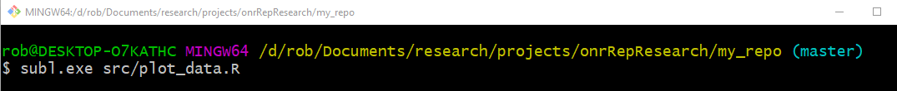
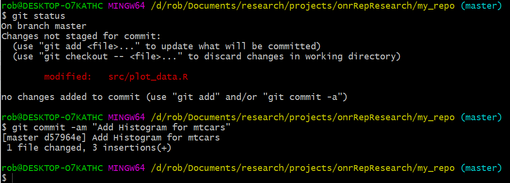
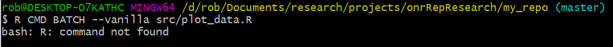
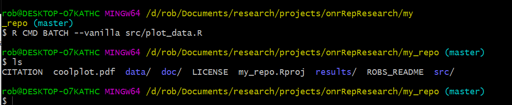
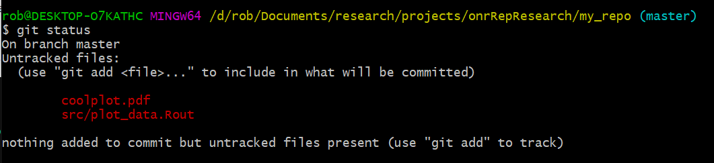
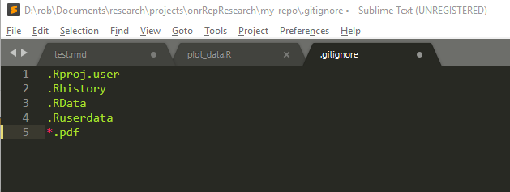
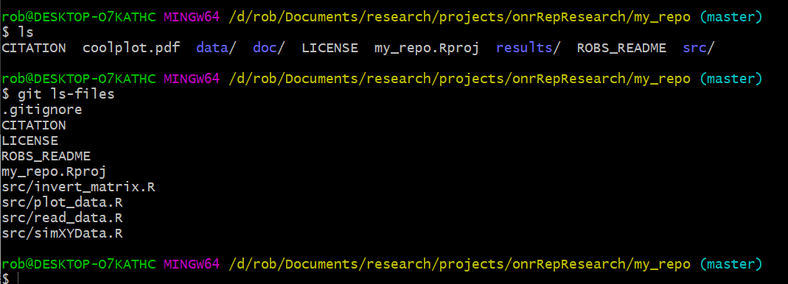

## ```.gitignore```
Ok, let's get our hands dirty with a ```.gitignore``` file to see how we can have ```git``` stop paying attention to particular files. 
We'll start at the terminal (gitbash on windows, regular terminal on Mac OSx). From in there, fire up your plotting script using your text editor:


In your text editor, add some code to your plotting script write code to produce a pdf file:


```r
pdf(file = 'coolplot.pdf')
  hist(mtcars$disp)
dev.off()
```

Save the file and head back to the terminal. Now we have to check the status (of course!) and commit the changes.



Once the repo is clean, run this R code:

Windows (note that your path may change slightly based on your install and version of R; don't despair if it doesn't work - there's a workaround below):


```bash
/C/Program\ Files/R/R-3.6.2/bin/R.exe CMD BATCH --vanilla src/plot_data.R
```

Mac:

```bash
R CMD BATCH --vanilla src/plot_data.R
```

And what happens? Path dependencies -- maybe? Most likely only for the Windows users.


  
Which is annoying, but fixable by adding the environment variables and restarting git bash. 

When you issue it after adding the path, and then type ```ls```, you'll see the pdf listed:




> Nota bene -- if you don't want to mess around with the path variables, I've also added a pdf to the box link - ```gm175.pdf``` You can just add this file to the repository manually

So whether you made it from R, or manually added it in, type ```git status``` to see what ```git``` makes of the new file (nb that the pdf file name may be different):



Ok, so ```git``` sees it and is asking you to add it. But we don't want to add it, because this file may change over time. So we can tell ```git``` to ignore it. 

Make a .gitignore file (use the touch command)


```bash
touch .gitignore
```

Use your text editor and add ```*.pdf``` to the contents of the ```.gitignore``` file. Here's a screenshot, but note that I have a few extra things in there. You can ignore those for now.



Use git add & git commit on the .gitignore file


```bash
git add .gitignore
git commit -m "Add pdf Files to .gitignore"
```

At the command line, issue the ```ls``` command. (you should see the pdf listed)

At the command line, issue the ```git ls-files``` command. (you should _not_ see the pdf listed)

It looks like this:




All done!
