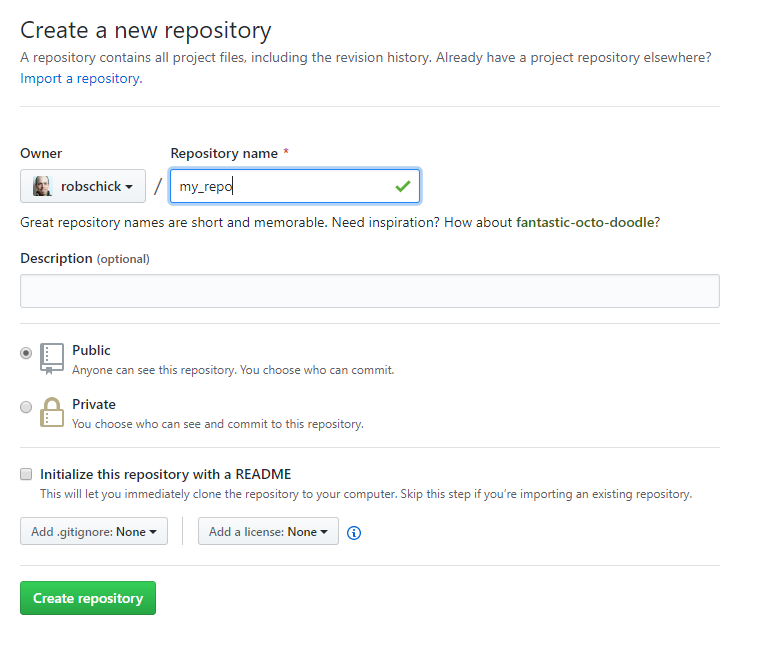
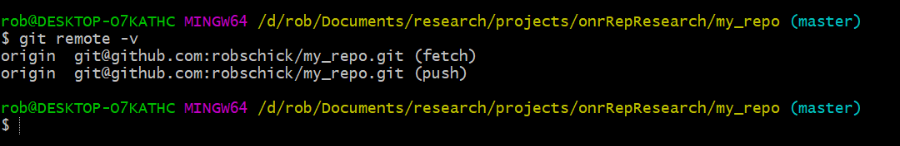
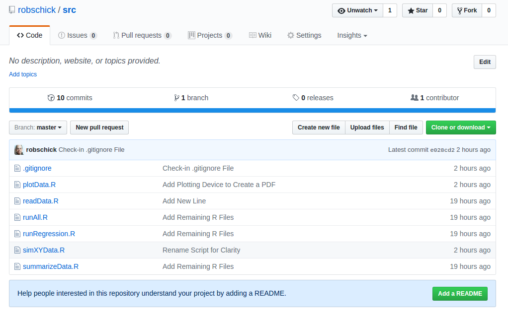
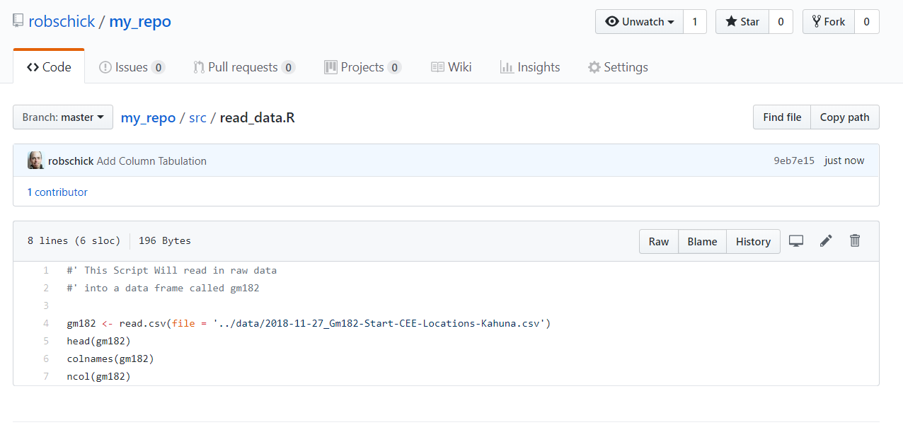
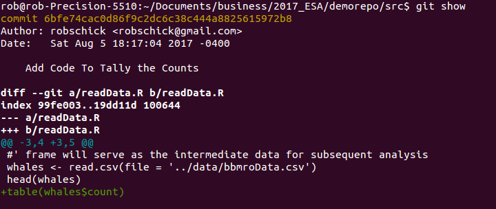
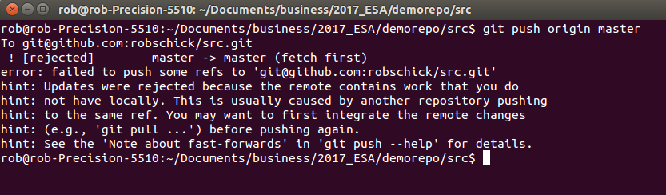
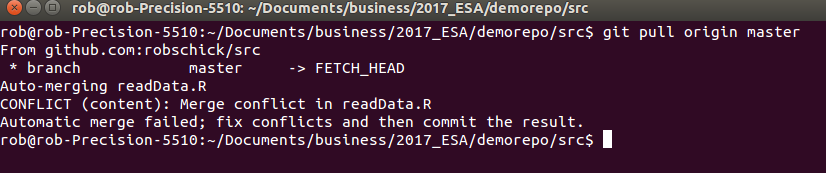
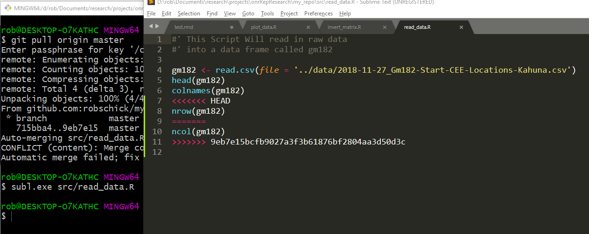

```{r setup, include=FALSE}
knitr::opts_chunk$set(echo = TRUE)
```

# Part 1 - Connecting to GitHub
We're almost done - phew! 

We've covered a lot of ground, but there's still another important lesson, and that is embracing what some people call the 4th state of git - the remote repository. There are many ways to make the connections between your computer and GitHub. Sometimes they all seem sort of similar but different in frustrating ways, i.e. you might think you are following a work-flow that worked for you only to run into some weird unexplained git error.

Important note here - git is huge and can be frustrating - but since it's huge and since it was developed by an uber-nerdy crowd, there are a lot of resources out there. My first thing to do if I see an error I don't understand, is to type it into ~~google~~ duckduckgo, and start browsing the answers on StackOverflow. At current count, there are [117,721 questions](https://stackoverflow.com/questions/tagged/git) tagged with ```git``` on stack overflow. Chances are, the answer is out there!

(Fun fact, when I taught this last May, there were 110,650 questions. That's about 900 new per month.)

At any rate, one good workflow to make a connection between a local repo and GitHub is as follows. 

## Github First
If we start by initializing the repository on GitHub, this usually assumes you have no local code. The process flow to do that is something like this:

* on GitHub, create a new repository. I typically add an R themed .gitignore file, and a README
* copy its url (http) to clone it
* Navigate to the parent folder, clone the repo 
* At this point you can either cd into the repo and start work, or if you want to work in RStudio, simply start a new project with the "Existing Directory" option chose the repo and the git tab will appear.

You can also bypass the cloning from the command line by choosing the option to clone from a repo, but make sure all your ssh keys/ducks are in a row.


## Local First
However, what if you already have a local repo that is not connected to GitHub? This is the situation _we have here._

First, in your local repo, type this:

```{r engine='bash', eval=FALSE}
git remote -v
```

You should see nothing! How do we connect to GitHub then? The process flow here is:

1. Go to GitHub and make a new __empty__ repo using the same name as the one on your computer (you can use different names, but let's keep it simple for now)
2. Copy the url of the repo - using the html option
3. Add the remote url to your local repository
4. Verify the connections
5. Push the changes.

Let's see what that looks like graphically:



Once you click on Create Repository, GitHub gives you this _really_ helpful page:


In our case, we're going to push the existing repo *from* the command line (note that of course your url will be different):

```{r addRemote, engine='bash', eval=FALSE}
git remote add origin https://github.com/robschick/my_repo.git
```

Once we've added it, let's look again to see if we are talking to github:

```{r checkRemote, engine='bash', eval=FALSE}
git remote -v
```

I see this now (note that I used SSH, yours will look a bit different since you used html):




With it added, then let's push our changes
```{r checkRemote2, engine='bash', eval=FALSE}
git push -u origin master
```

And finally we can see them on GitHub to make sure all is right.



Ok - back to the Lecture

# Part 2 -- Merge Conflict
The dreaded merge conflict! These can be a pain in the butt when you first encounter them, but all in all, they are pretty straightforward. As you get more advanced with git, you can configure a graphical merge tool if you want to help with this. They can be great, but for now, we'll just handle this on the command line.

What is a merge conflict? It's essentially what happens when the repository gets out of sync. Let's say you make a change on your local computer, and push it to GitHub, but then you working on a node like the Duke Compute Cluster, and you make a change there - but you haven't yet brought down the most up to date changes from GitHub. When you go to push your changes up to the node, you will get rejected, and then you have to manually resolve the conflict. 

We don't have a node here, but we can mimic it well enough with a local repo and GitHub:

1. In your repo on your computer, make a change to a file, add it, and commit it, but don't push it to GitHub.
2. Then, navigate to GitHub, and make a change to the same file on the same line of code. Use the pencil icon to edit it directly
3. Add a commit message, and commit the change
4. Navigate back to the command line and issue the ```git push``` command
5. If you are lucky, all hell will break loose

Here's what I have on GitHub



And what I have locally after I make a change, add it, and commit it:



Ok, let's give it a whirl:

```{r engine='bash', eval=FALSE}
git push origin master
```



Sad times, but we can fix the problem. First, let's pull.

```{r engine='bash', eval=FALSE}
git pull origin master
```

And here we see the conflict:


Now we have to fix them manually, which we do in a text editor



Once it's resolved, then we go through the regular cycle again:

```{r engine='bash', eval=FALSE}
git commit -am "Resolve Merge Conflict"
git push origin master
```


# Part 3 -- Practice Going Through The Cycle Again
So now we've pushed up all of the changes we have made to date locally, so they are mirrored on GitHub. One of the biggest advantages of using git, or any distributed version control system, is that you now have multiple points of failure, instead of just one, i.e. you've increased your [bus factor](https://en.wikipedia.org/wiki/Bus_factor) and ths is always a good thing. 

When we work with a remote repo, we now add an extra stage to our local git workflow. From time to time, we need to push our local changes to the remote repository. How often you do this is a matter of personal preference. I tend to do it a lot, especially since my code is typically only being used by me. For someone like Hadley Wickham who is writing a lot of influential R code, his feeling is that pushing is essentially publishing. So each time you push, it had better work!

Go ahead and repeat the cycle in RStudio. 

Specifically do these next steps:

1. Choose one of your existing R files
2. Add some code & save the file
3. Add these changes with ```git add```
4. Commit the changes (note that since these files are already tracked, you can go the express commit: ```git commit -am "..."```)
5. Push the changes
6. View them on GitHub

One best practice is to issue the ```git pull``` command before you push. This just ensures that you have the most up to date code before you push, and is especially helpful when you collaborate with more people on the same codebase. 
