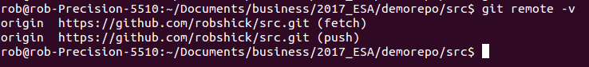
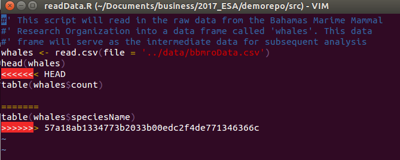

# Lesson 4 - Working Remotely


# Part 1 - Connecting to GitHub
At this point we've covered a lot of ground, but there's still another important lesson, and that is embracing what some people call the 4th state of git - the remote repository. There are many ways to do this, and sometimes they all seem sort of similar but different in frustrating ways, i.e. you might think you are following a work-flow that worked for you only to run into some weird unexplained git error.

Important note here - git is huge and can be frustrating - but since it's huge and since it was developed by an uber-nerdy crowd, there are a lot of resources out there. My first thing to do if I see an error I don't understand, is to type it into ~~google~~ duckduckgo, and start browsing the answers on StackOverflow. At current count, there are ~~88,555 questions~~ [105,455 questions](https://stackoverflow.com/questions/tagged/git) tagged with ```git``` on stack overflow. Chances are, the answer is out there!

## Local Repo First
What if you already have a local repo that is not connected to GitHub? Sort of like we have here. First type this:


```bash
git remote -v
```

You should see nothing! How do we connect to github then? Follow these steps:

1. Go to github and make a new _empty_ repo using the same name as the one on your computer (you can use different names, but let's keep it simple for now).
2. Copy the url of the repo - using the ssh option
3. Add the remote locally
4. Verify the connections
5. Push the changes.

Let's see these steps in action:


Once you click on Create Repository, GitHub gives you this _really_ helpful page:


In our case, we're going to push the existing repo *from* the command line (note that of course your url will be different):


```bash
git remote add origin https://github.com/robschick/src.git
```

Once we've added it, let's look again to see if we are talking to github:


```bash
git remote -v
```

I see this now:




With it added, then let's push our changes

```bash
git push -u origin master
```

And finally we can see them on GitHub to make sure all is right.


# Part 2 -- Create the Merge Conflict
The dreaded merge conflict! These can be a pain in the butt when you first encounter them, but all in all, they are pretty straightforward. As you get more advanced with git, you can configure a graphical merge tool if you want to help with this. They can be great, but for now, we'll just handle this on the command line.

What is a merge conflict? It's essentially what happens when the repository gets out of sync. Let's say you make a change on your local computer, and push it to github, but then you working on a node, and you make a change there - but you haven't yet brought down the most up to date changes from GitHub. When you go to push your changes up to the node, you will get rejected, and then you have to manually resolve the conflict. 

We don't have a node here, but we can mimic it well enough with a local repo and GitHub:

1. In your repo, make a change to a file, add it, and commit it, but don't push it to GitHub.
2. Then, navigate to github, and make a change to the same file. Use the pencil icon to edit it directly
3. Add a commit message, and commit the change
4. Navigate back to the command line and issue the ```git push``` command
5. If you are lucky, all hell will break loose

Here's what I have on GitHub


And what I have locally:


Ok, let's give it a whirl:


```bash
git push origin master
```


Sad times, but we can fix the problem. 

# Part 3 -- Resolve the Merge Conflict
First, let's pull.


```bash
git pull origin master
```

And here we see the conflict:


Now we have to fix them manually, which we do in a text editor



Once it's resolved, then we go through the regular cycle again:


```bash
rob@rob-Precision-5510:~/Documents/business/2017_ESA/demorepo/src$ vi readData.R 
rob@rob-Precision-5510:~/Documents/business/2017_ESA/demorepo/src$ git add readData.R 
rob@rob-Precision-5510:~/Documents/business/2017_ESA/demorepo/src$ git commit -m "Resolve Merge Conflict with GitHub Code"
[master 2cf2829] Resolve Merge Conflict with GitHub Code
rob@rob-Precision-5510:~/Documents/business/2017_ESA/demorepo/src$ git push origin master
```


