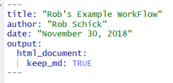
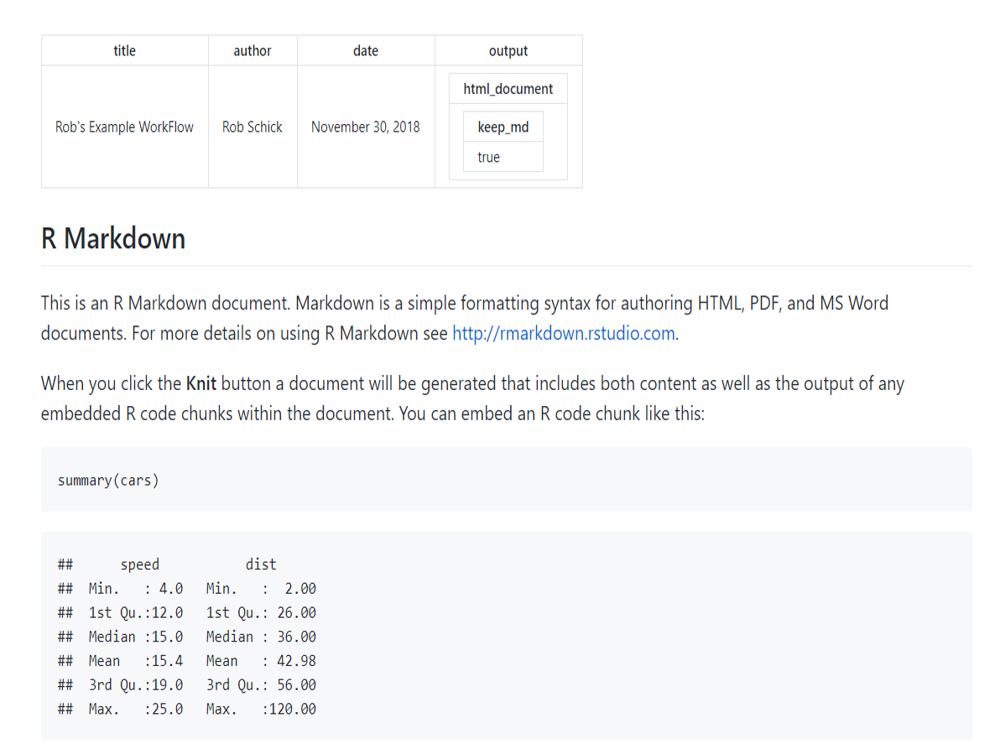

# Browsable Repos
Ok, this is a small, but helpful little tweak to make your code look a bit nicer on GitHub. The idea is that when you use an .Rmd file, the output is html, which GutHub doesn't nicely render. So instead we'll change our yaml to include the intermediate markdown.

Since we want to keep practicing, we'll start by making a whole new repo over again on GitHub first. The flow will look like this

1. Navigate to GitHub and make a new repository
2. Make a new project in RStudio and use the GitHub URL
3. Populate the project with a new .Rmd file (use RStudio's default)
4. Add and commit the Rmd file to git
5. Push the commit to GitHub

# Changing the Header

Right now the default yaml header in the .Rmd file looks like this:

We want to see what this looks like on GitHub. 

1. Compile or knit the Rmd file, which will produce and html file
2. Add the html file
3. Commit
4. Push to GitHub
5. Navigate in your web browser to the repo and look at the .html file
6. What do you think?

We can make it better by changing the header to keep the intermediate markdown.

We want to see what this looks like on GitHub once we keep the markdown. 

1. Compile or knit the Rmd file, which will produce a new html file along with a markdown file
2. Add the md file
3. Commit
4. Push to GitHub
5. Navigate in your web browser to the repo and look at the .md file
6. What do you think?

You should see this:

Ok - back to the Lecture

